# Исследовательская работа по оптимизации поиска слов в хэш таблице.

## Описание (будет добавлено позже)

### Аппаратное обеспечение
* **Процессор:** Intel® Core™ Ultra 9 285H
* **Режим питания:** «Оптимальная производительность» (от сети).

### Программная среда
* **WSL:** 6.6.87.2-microsoft-standard-WSL2
* **Компилятор:** g++ (Ubuntu 11.4.0-1ubuntu1~22.04.3) 11.4.0
* **Инструмент замера:** `hyperfine` (усреднение по 10 прогонам, 3 прогревочных цикла, в каждом прогоне 1000 тестов поиска по 579523 слов из англоязычной версии произведения Л. Н. Толстого "Война и мир").
* **Мониторинг температуры ядер и троттлинга процессора:** AIDA64
* **Используемый профиллировщик:** cachegrind 3.18.1

## 0. Первая версия программы, компиляция без флага -O3.

#### Benchmark 1: ./build/programWithoutO3 <br>
  Time (mean ± σ):     51.878 s ±  0.133 s    [User: 51.870 s, System: 0.007 s] <br>
  Range (min … max):   51.672 s … 52.147 s    10 runs <br>

#### AIDA64 Temperature and throttling graph

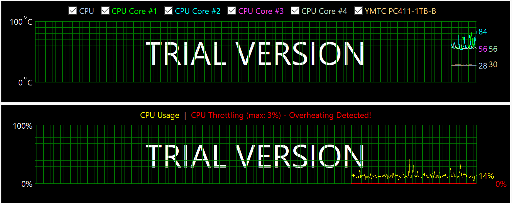

<u>**Все последующие версии программы компилировались с флагом -O3.**</u>

## 1. Первая версия программы, компиляция с флагом -O3.

#### Benchmark 1: ./build/programWithO3FirstVersion <br>
  Time (mean ± σ):     47.082 s ±  0.443 s    [User: 49.795 s, System: 0.005 s] <br>
  Range (min … max):   46.471 s … 47.975 s    10 runs <br>

**Увеличение скорости работы программы: <span style="color: rgb(18, 225, 18);">9,24%</span>**

#### AIDA64 Temperature and throttling graph

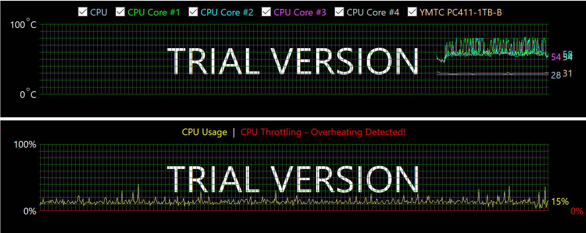

#### Cachegrind анализ
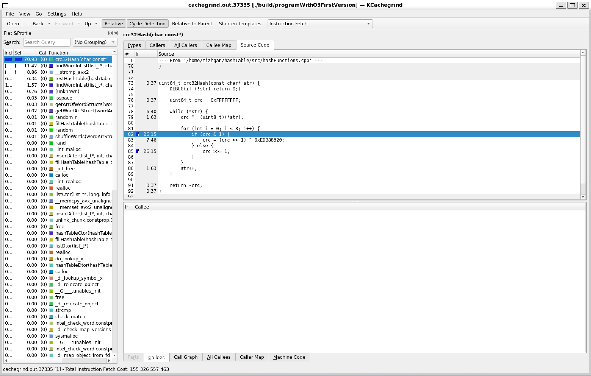

## 2. Замена C-реализации функции вычисления хэша crc32 на intrinsic.
Before:
```
uint64_t crc32Hash(const char* str) {
    DEBUG(if (!str) return 0;)

    uint64_t crc = 0xFFFFFFFF;

    while (*str) {
        crc ^= (uint8_t)(*str);

        for (int i = 0; i < 8; i++) {
            if (crc & 1)
                crc = (crc >> 1) ^ 0xEDB88320;
            else
                crc >>= 1;
        }
        str++;
    }

    return ~crc;
}
```
After:
```
uint64_t crc32Hash(const char* str) {
    DEBUG(if (!str) return 0;)

    uint64_t crc = 0xFFFFFFFF;

    while (*str) {
        crc = _mm_crc32_u8(crc, (uint8_t)*str);
        str++;
    }

    return crc;
}
```

#### Benchmark 1: ./build/programWithO3SecondVersion <br>
  Time (mean ± σ):     17.705 s ±  0.155 s    [User: 18.882 s, System: 0.005 s] <br>
  Range (min … max):   17.505 s … 17.861 s    10 runs <br>

**Увеличение скорости работы программы: <span style="color: rgb(18, 225, 18);">62.40%</span>**

#### AIDA64 Temperature and throttling graph

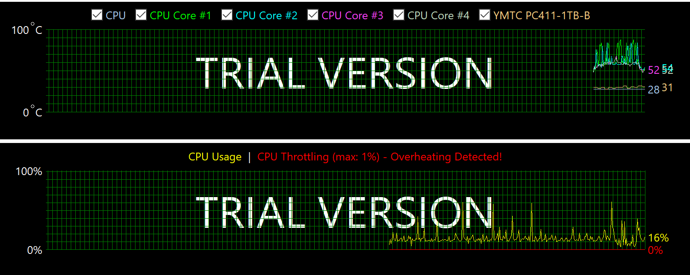

#### Cachegrind анализ
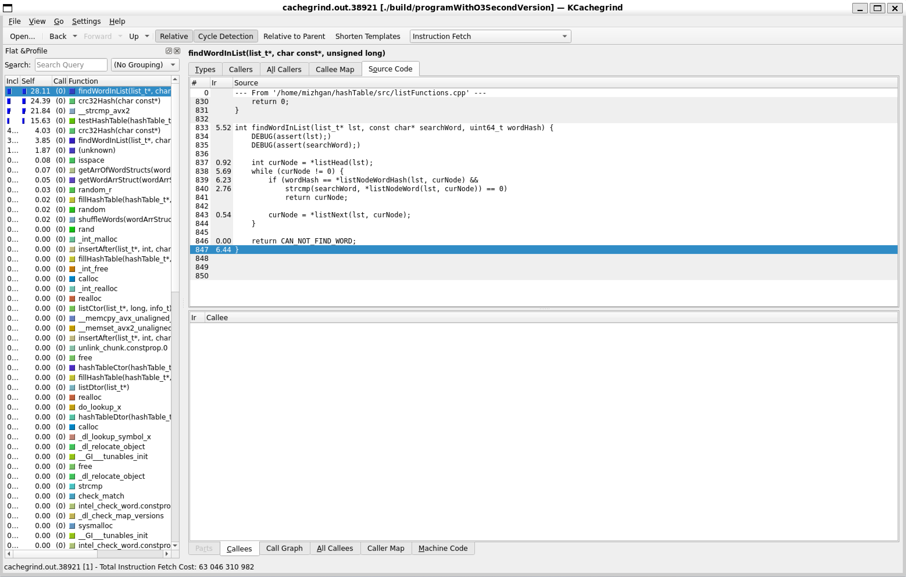

## 3. Замена C-реализации функции поиска слова в списке на ассемблерную.

Before:
```
int findWordInList(list_t* lst, const char* searchWord, uint64_t wordHash) {
    DEBUG(assert(lst);)
    DEBUG(assert(searchWord);)

    int curNode = *listHead(lst);
    while (curNode != 0) {
        if (wordHash == *listNodeWordHash(lst, curNode) &&
            strcmp(searchWord, *listNodeWord(lst, curNode)) == 0)
            return curNode;

        curNode = *listNext(lst, curNode);
    }

    return CAN_NOT_FIND_WORD;
}
```

After:
```
;----------------------------------------------------------------------------------------------
; Searches for a word in a list moving from head to tail.
; Entry: rdi = list pointer
;        rsi = search word
;        rdx = wordHash
; Exit: rax = node index which containssearched word
;             (const CAN_NOT_FIND_WORD if the word was not found)
;Expected:
;Destroyed: rax, rcx, r8, r9, r10, r11
;----------------------------------------------------------------------------------------------
findWordInList_asm:
                        mov r9, [rdi]                         ; r9 = nodeArr base address

                        xor rcx, rcx
                        mov ecx, dword [r9]                   ; ecx = nodeArr[0].next (listHead index)

                        test ecx, ecx                         ; if listHead == 0
                        jz .notFound

.loopStart:

                        lea r8, [rcx + rcx * 4]
                        lea r10, [r9 + r8 * 8]                      ; r10 = curNodeAddress

                        cmp rdx, [r10 + NODE_HASH_OFFSET]           ; cmp hashes
                        je .cmpString

.nextNode:
                        mov ecx, dword [r10 + NODE_NEXT_OFFSET]     ; ecx = curNode.next
                        test ecx, ecx                               ; if (next != 0)
                        jnz .loopStart

.notFound:
                        mov rax, CAN_NOT_FIND_WORD
                        ret

.cmpString:
                        mov r8, rsi                         ; r8 = searchWord ptr
                        mov r11, [r10 + NODE_WORD_OFFSET]   ; r11 = node word ptr

.strcmpLoop:
                        mov al, byte [r8]
                        cmp al, byte [r11]
                        jne .nextNode

                        test al, al                 ; found if (curByte == '\0')
                        jz .found

                        inc r8
                        inc r11
                        jmp .strcmpLoop

.found:
                        mov rax, rcx
                        ret
```

#### Benchmark 1: ./build/programWithO3ThirdVersion  <br>
  Time (mean ± σ):     17.322 s ±  0.203 s    [User: 18.235 s, System: 0.006 s]  <br>
  Range (min … max):   16.951 s … 17.668 s    10 runs  <br>

**Увеличение скорости работы программы: <span style="color: rgb(18, 225, 18);">2,16%</span>**

#### AIDA64 Temperature and throttling graph

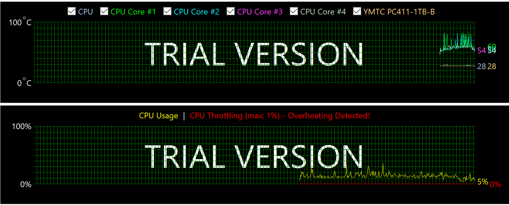

#### Cachegrind анализ
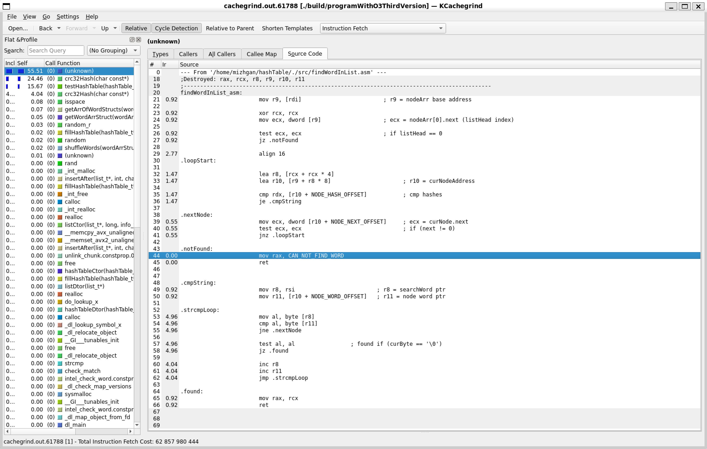

## 4. Векторизация функции сравнения строк.
Before:
```
.cmpString:
                        mov r8, rsi                         ; r8 = searchWord ptr
                        mov r11, [r10 + NODE_WORD_OFFSET]   ; r11 = node word ptr

.strcmpLoop:
                        mov al, byte [r8]
                        cmp al, byte [r11]
                        jne .nextNode

                        test al, al                 ; found if (curByte == '\0')
                        jz .found

                        inc r8
                        inc r11
                        jmp .strcmpLoop

.found:
                        mov rax, rcx
                        ret
```
After:
```
.cmpString:
                        mov r8, rsi                         ; r8 = searched Word
                        mov r11, [r10 + NODE_WORD_OFFSET]   ; r11 = curNode word

                        vpxor ymm3, ymm3, ymm3

                        vmovdqu ymm0, [r8]                  ; ymm0 = searched word vector
                        vmovdqu ymm1, [r11]                 ; ymm1 = curNode word vector

                        vpcmpeqb ymm2, ymm0, ymm1
                        vpmovmskb eax, ymm2                 ; eax = cmp words mask

                        vpcmpeqb ymm4, ymm0, ymm3
                        vpmovmskb r8d, ymm4                 ; r8d = mask of the '\0' position

                        not eax                             ; eax = differences mask
                        tzcnt eax, eax                      ; eax = first difference position
                        tzcnt r8d, r8d                      ; r8d = first '\0' position

                        cmp eax, r8d
                        jae .found

                        vzeroupper
                        jmp .nextNode

.found:
                        vzeroupper
                        mov rax, rcx
                        ret
```

#### Benchmark 1: ./build/programWithO3FourthVersion <br>
  Time (mean ± σ):     15.668 s ±  0.140 s    [User: 16.376 s, System: 0.006 s]  <br>
  Range (min … max):   15.459 s … 15.860 s    10 runs  <br>

**Увеличение скорости работы программы: <span style="color: rgb(18, 225, 18);">9,55%</span>**

#### AIDA64 Temperature and throttling graph

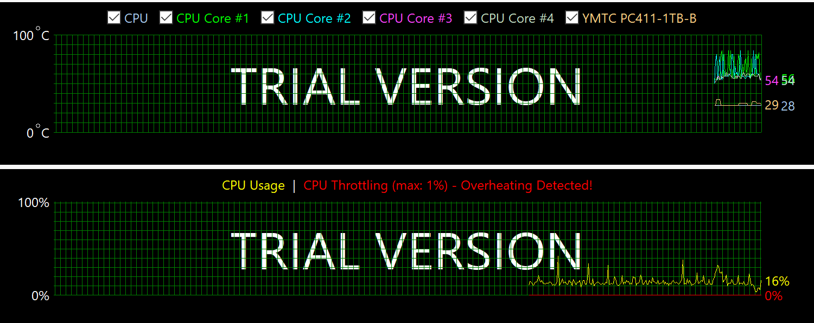

#### Cachegrind анализ
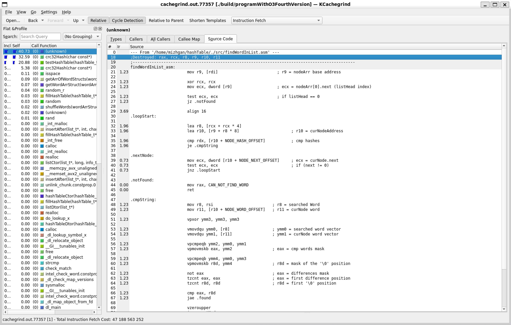

## 5 Inline asm вставка для вычисления индекса списка.
Before:
```
size_t index = wordHash % *hashTableArrSize(hashTable);
```
After:
```
    size_t index = 0;
    uint64_t remainder = 0;

    __asm__ volatile (
        ".intel_syntax noprefix\n"
        "mul %3\n"
        ".att_syntax prefix\n"
        : "=d" (index), "=a" (remainder)
        : "a" (wordHash), "r" (*hashTableArrSize(hashTable))
        : "cc"
    );
```

#### Benchmark 1: ./build/programWithO3FifthVersion <br>
  Time (mean ± σ):     15.216 s ±  0.194 s    [User: 16.382 s, System: 0.006 s] <br>
  Range (min … max):   14.771 s … 15.418 s    10 runs <br>

**Увеличение скорости работы программы: <span style="color: rgb(18, 225, 18);">2,88%</span>**

#### AIDA64 Temperature and throttling graph
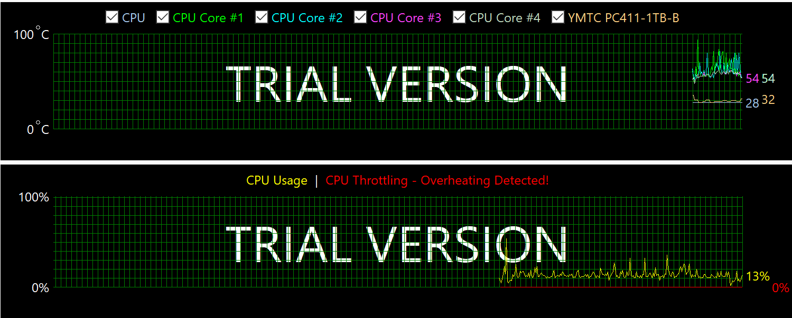

#### Cachegrind анализ
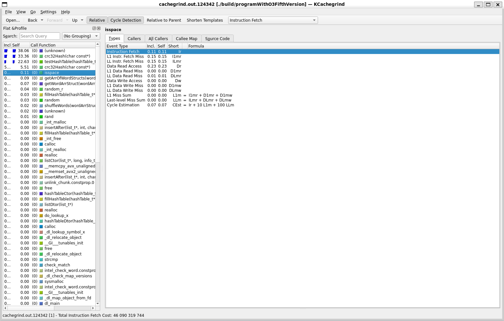


## 6. Inline asm prefetch слов при заполнении таблицы и поиска по ней.<br>(Финальная версия программы)
```
    if (curWordNum + 1 < *structArrNumberOfWords(wordArr)) {
        const char* nextWord = *structArrWord(wordArr, curWordNum + 1);
        __asm__ volatile (
            ".intel_syntax noprefix\n"
            "prefetcht0 [%0]\n"
            ".att_syntax prefix\n"
            :
            : "r" (nextWord)
            : "memory"
        );
    }
```

#### Benchmark 1: ./build/programWithO3SixthVersion <br>
  Time (mean ± σ):     13.693 s ±  0.086 s    [User: 13.688 s, System: 0.004 s] <br>
  Range (min … max):   13.577 s … 13.890 s    10 runs <br>

**Увеличение скорости работы программы: <span style="color: rgb(18, 225, 18);">10,01%</span>**

#### AIDA64 Temperature and throttling graph
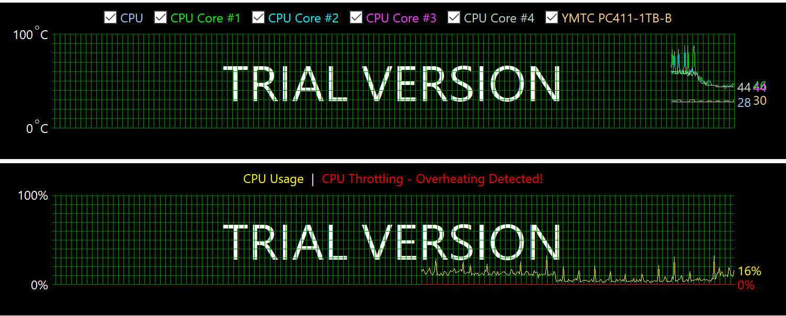

#### Cachegrind анализ


## 7. Inline asm вставка для устранение условного перехода. (Оптимизация была удалена)
Before:
```
    if (wordNodeNum == CAN_NOT_FIND_WORD)
            return 0;
    else return 1;
```
After:
```
    __asm__ volatile (
        ".intel_syntax noprefix\n"
        "cmp %1, %2\n"
        "setne al\n"
        "movzx %0, al\n"
        ".att_syntax prefix\n"
        : "=r" (isFound)
        : "r" (wordNodeNum), "r" (CAN_NOT_FIND_WORD)
        : "cc", "al"
    );

    return isFound;
```

#### Benchmark 1: ./build/programWithO3SeventhVersion  <br>
  Time (mean ± σ):     13.595 s ±  0.097 s    [User: 13.588 s, System: 0.007 s]  <br>
  Range (min … max):   13.457 s … 13.718 s    10 runs  <br>

**Увеличение скорости работы программы: <span style="color: rgb(255, 12, 12);">0.72%</span>**<br>
<u>Оптимизация была удалена ввиду незначительного прироста к скорости программы.</u>

#### AIDA64 Temperature and throttling graph


## *Компиляция с PGO последней версии программы.

#### Benchmark 1: ./build/programPGO <br>
  Time (mean ± σ):     12.594 s ±  0.031 s    [User: 12.585 s, System: 0.008 s] <br>
  Range (min … max):   12.541 s … 12.637 s    10 runs <br>

**Увеличение скорости работы программы: <span style="color: rgb(18, 225, 18);">7,36%</span>**

#### AIDA64 Temperature and throttling graph
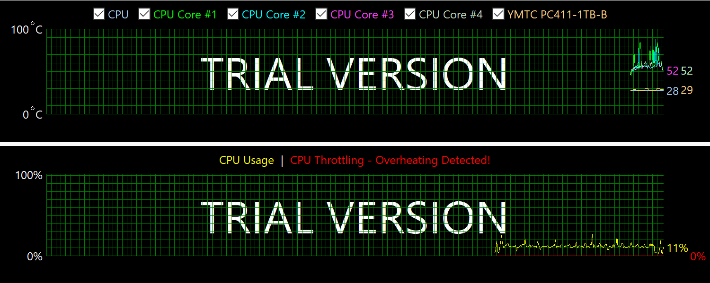


<br><br>
**Итого:** C помомщью ручных оптимизаций получилось добиться ускорения в <span style="color: rgb(18, 225, 18);">3,44</span> раза. (programWithO3SixthVersion.exe в сравнении с programWithO3FirstVersion.exe)
